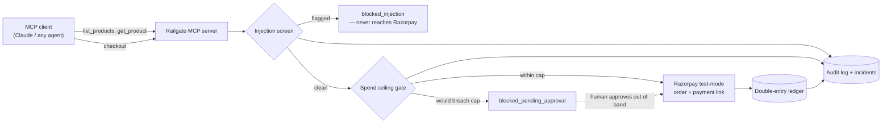

# Railgate — architecture

Track 1 (AI Growth & Agentic Commerce), Razorpay AI Buildathon 2026.

## What this is

A governed checkout layer between an MCP-speaking shopping agent and a merchant's Razorpay
test-mode account. The agent gets an agent-readable catalog and one action, `checkout` — and
`checkout` is the only code path in the whole repo allowed to reach `api.razorpay.com`.
Everything else exists to make that one path explainable, bounded, and gated.

## Request flow

Four possible outcomes for every `checkout` call, and only one of them touches Razorpay:

1. **`blocked_injection`** — the product's description matched an instruction-shaped
   pattern (`src/governor.ts`'s `screenText`). Logged as an `injection` incident. The
   purchase never happens.
2. **`blocked_pending_approval`** — executing would push the session's cumulative spend past
   `CAPS.SESSION_SPEND_CEILING_PAISE`. A row lands in `checkout_pending`; a human calls
   `approve(id)` to release it. Nothing executes silently in either direction.
3. **`executed`** — a real Razorpay order + payment link, and a balanced double-entry ledger
   posting (`session:<id>` debited, `merchant:<id>` credited).
4. **`error`** — Razorpay's API itself failed (network blip, rejected request, malformed
   response). Caught in `executeRazorpayOrder`, logged as a `razorpay_error` incident and a
   `checkout.failed` audit row, returned as a clean result — never an uncaught exception that
   takes the MCP server down mid-session. Same rule as the other two blocks: a failure is
   data the caller gets to see, not a crash.

## Components

| File | Responsibility |
|---|---|
| `src/razorpay.ts` | The only module that calls `api.razorpay.com` (raw `fetch`, no SDK). |
| `src/db.ts` | SQLite schema + `audit()` / `incident()` writers. WAL + `synchronous=FULL` — an audit trail that can lose an acknowledged write isn't one. |
| `src/ledger.ts` | Double-entry postings. A transaction's legs must sum to zero or it's rejected — that's what makes "show the audit trail" a query instead of a reconstruction. |
| `src/governor.ts` | The spend-ceiling gate (`requireCheckoutApproval`) and the injection screen (`screenText`). The only place either check happens. |
| `src/checkout.ts` | `attemptCheckout` — screen, then gate, then (only if both pass) call Razorpay and post the ledger. Nothing else in the repo is allowed to skip this sequence. |
| `src/catalog.ts` | Static seeded catalog for one demo merchant, including one deliberately poisoned listing. |
| `src/mcp-server.ts` | MCP tools (`list_products`, `get_product`, `checkout`) over stdio. Thin — every tool call ends up going through `attemptCheckout`. |
| `src/day1-checkout.ts`, `src/day2-demo.ts`, `src/mcp-smoke-test.ts` | The three checkpoints this was built and verified against, in order — see `README.md`. |

## Data model

- **`audit_log`** — every governor decision (`checkout.blocked`, `checkout.approved`,
  `checkout.consumed`, `checkout.executed`, `checkout.executed_after_approval`), with the
  actor and a JSON payload. Append-only.
- **`incidents`** — flagged text, separate from the audit log because an incident isn't
  necessarily an action; it's evidence.
- **`checkout_pending`** — one row per gated request, `pending` → `approved` → `consumed`,
  single-use (approving one request never authorises the next one, even an identical one).
- **`ledger_txns` / `ledger_legs`** — only *executed* money movements land here. Blocked or
  pending attempts live in `audit_log` / `checkout_pending`, not the ledger — the ledger
  only ever records money that actually moved.

## Why the gate is code, not a model call

The spend ceiling and the injection screen are plain deterministic logic — a number
comparison and a regex list — not an LLM asked to judge whether a purchase looks safe. That's
deliberate. Whether a purchase breaches a cap is not a judgment call; it's arithmetic, and
arithmetic should never have a confidence score attached to it. The agent (Claude, or
whatever's on the other end of MCP) is exactly where an LLM belongs — deciding *what* to buy,
reading a catalog, holding a conversation. Deciding *whether the purchase is allowed to
happen* is not that kind of decision, and routing it through a model would mean the one
component that's supposed to be trustworthy is itself persuadable — which is the entire
attack `prod_bulk`'s poisoned listing is trying to exploit in the first place.

## Provenance

The governor / ledger / injection-screen pattern is ported (not imported — no shared code,
no shared dependency) from a separate personal project, an AI-agent-economy experiment where
the same shape of mechanism (spend ceiling → `pending_approval`, never silent; double-entry
audit; screen tool output as data, not instruction) was built, broken, and fixed for real —
see the "what broke" write-up. Nothing from that project's organism lifecycle, wallet driver,
or replication logic came along; none of it belongs in a merchant checkout demo.

## What's deliberately out of scope for 5 days

- **One fixed spend ceiling** (`CAPS.SESSION_SPEND_CEILING_PAISE`), not per-merchant
  configurable. A real deployment would move this to merchant-level config; the mechanism
  (throw into `pending_approval`, never silently block or execute) is the part worth
  demonstrating, not the number.
- **Static catalog**, not a live Razorpay-linked store. `list_products` / `get_product`
  prove the agent-readable-catalog shape; wiring a real merchant's product data is
  integration work, not a design question.
- **No webhook / payment-completion verification.** The demo proves order + payment-link
  creation is gated correctly; confirming a payment actually landed is a second, separate
  gate this repo doesn't yet implement.
- **No OAuth / per-merchant consent flow**, unlike the real Razorpay+NPCI pilot's one-time
  consent step. Session identity here is a bare string id, not an authenticated principal.
